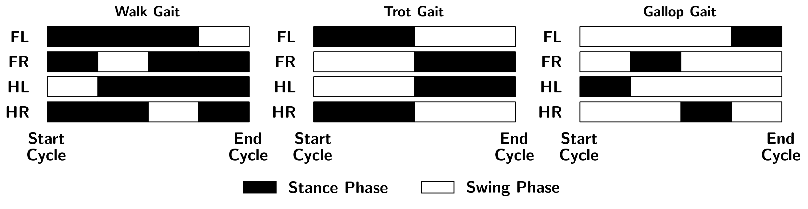
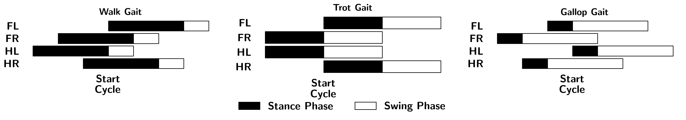

# Gait Planner

This page discusses the details of a gait planner.

## What are gaits?

The gaits describe how a quadruped walks or runs. The most common quadruped we see in our life is a horse, thus, many of the terminology used in quadrupedal robots are borrowed from what people use to describe the motion of horses. 

Unlike humans, which are bipeds, horses can walk in many different ways, it can move one leg at a time, two legs at a time, and (yes you guessed it) three legs at a time. Decided by the different number of legs it moves at each time, the motion would look very different. 

When it is moving one leg at a time, we call this a walking gait, two legs is trotting, and three legs is galloping. We can draw the stance and swing leg phase plot for each of the gaits:

:::{figure-md} GaitPhasePlots



Swing and stance leg phase plot for walking, trotting, and galloping gaits. [[notebook](../notebooks/GaitPlots.ipynb)]
:::

We can then create a gait planner for our quadruped robot which will tell us at each time which foot are on the ground and which are in the air.

## Planner

If we slightly move the gait bars around, we have the following plot

:::{figure-md} GaitPhaseOffsetPlots



Swing and stance leg phase plot for walking, trotting, and galloping gaits with an offset. [[notebook](../notebooks/GaitPlots.ipynb)]
:::

We can see for all of the gaits, the swing-stance phase of each leg can be described using two values, a stance duration and an offset. Note that the offset is computed with respect to the "Start Cycle" time. Take the walking gait for example, the front left (FL) leg has an offset of zero and stance duration of $0.75T$, with $T$ being the cycle length. Similarly, we have


|      Leg          | Gait Type |  Offset   | Stance Duration |
|:-----------------:|:---------:|:---------:|:----------------|
|  Front Left (FL)  |  Walking  |  $0.0T$   |     $0.75T$     |
|  Front Right (FR) |  Walking  |  $-0.5T$  |     $0.75T$     |
|  Hind Left (HL)   |  Walking  |  $-0.75T$ |     $0.75T$     |
|  Hind Right (HR)  |  Walking  |  $-0.25T$ |     $0.75T$     |

Then, we can determine whether a leg is in stance phase or not using a simple `if-else` check

```python
normalized_time = (offset + clock_time) % cycle_length

if normalized_time <= stance_duration:
    IN_STANCE_PHASE = True
else:
    IN_STANCE_PHASE = False
```